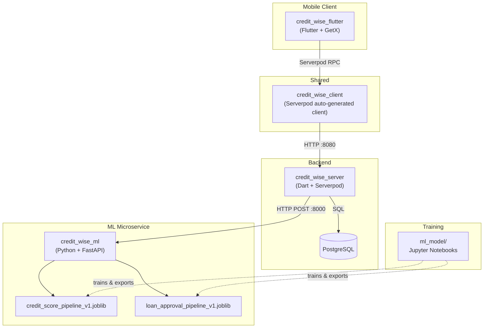
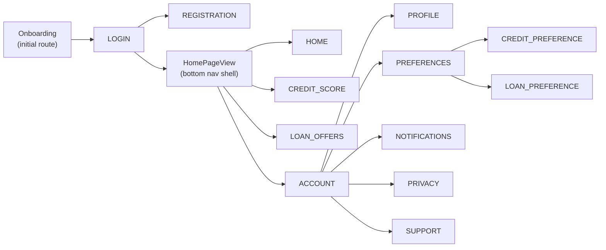
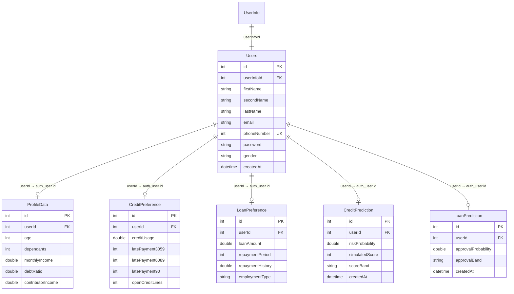
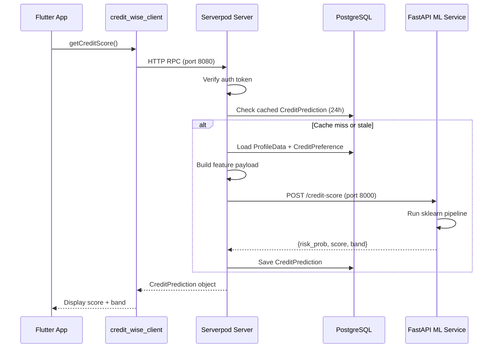

# Credit Wise — Full Architecture Walkthrough

**Credit Wise** is a mobile app that estimates a user's credit score and loan approval likelihood using machine learning models, backed by a Dart/Serverpod server and a Python/FastAPI ML microservice.

---

## High-Level Architecture

---

## Module Breakdown

### 1. `credit_wise_flutter` — Mobile Frontend

| Aspect | Details |
|---|---|
| **Framework** | Flutter with `flutter_screenutil` for responsive sizing |
| **State Mgmt** | GetX (controllers, bindings, routing) |
| **Auth** | `serverpod_auth_shared_flutter` + `SessionManager` |
| **Charts** | `fl_chart` for credit score visualization |
| **Entry Point** | `lib/main.dart` |

**App Navigation Flow:**

**Key routes** defined in `app_routes.dart`:

| Route | View | Purpose |
|---|---|---|
| `/onboarding` | `OnboardingView` | Welcome screens |
| `/login` | `LoginView` | Phone + password login |
| `/registration` | `RegistrationView` | New user sign-up |
| `/home_view` | `HomePageView` | Bottom-nav container |
| `/home` | `HomeView` | Dashboard |
| `/credit-score` | `CreditScoreView` | Credit score display |
| `/loan-offers` | `LoanOffersView` | Loan approval result |
| `/account` | `AccountView` | User settings hub |
| `/account/profile` | `ProfileView` | Edit profile data |
| `/account/preferences` | `PreferencesView` | Preference categories |
| `/account/preferences/credit-preference` | `CreditPreferenceView` | Credit input form |
| `/account/preferences/loan-preference` | `LoanPreferenceView` | Loan input form |

**Startup** (`main.dart`):
1. Creates a `Client` pointing at `http://localhost:8080/`
2. Sets up `FlutterAuthenticationKeyManager` + `SessionManager`
3. Registers `Client` and `SessionManager` as permanent GetX singletons
4. Launches `GetMaterialApp` with theme and routes

---

### 2. `credit_wise_client` — Shared Client Library

- Auto-generated by **Serverpod** from the server's model YAML files
- Contains Dart model classes matching every server model: `Users`, `ProfileData`, `CreditPreference`, `LoanPreference`, `CreditPrediction`, `LoanPrediction`
- Also generates typed RPC method stubs for each endpoint
- Referenced by `credit_wise_flutter` via `path: ../credit_wise_client` dependency

---

### 3. `credit_wise_server` — Backend Server

| Aspect | Details |
|---|---|
| **Framework** | Serverpod 3.2.3 |
| **Auth** | `serverpod_auth_server` + bcrypt password hashing |
| **Database** | PostgreSQL (managed by Serverpod migrations) |
| **Deployment** | Docker + Dockerfile + docker-compose |

#### Data Models (`.spy.yaml`)

#### Endpoints

| Endpoint Class | Method | Auth? | What It Does |
|---|---|---|---|
| `AuthEndpoint` | `registerUser` | No | Creates `UserInfo` + `Users` row, hashes password with bcrypt |
| `AuthEndpoint` | `loginUser` | No | Verifies password, returns auth token via `UserAuthentication.signInUser` |
| `ProfileEndpoint` | `getAppUser` | ✅ | Returns the `Users` record for the authenticated user |
| `ProfileEndpoint` | `createProfileData` | ✅ | Upserts `ProfileData` (age, income, debt ratio, etc.) |
| `CreditEndpoint` | `createCreditPreference` | ✅ | Upserts `CreditPreference` (credit usage, late payments) |
| `LoanEndpoint` | `createLoanPreference` | ✅ | Upserts `LoanPreference` (amount, repayment, employment) |
| `PredictionEndpoint` | `getCreditScore` | ✅ | Aggregates profile + credit data → POSTs to ML `/credit-score` → caches result 24h |
| `LoanPredictionEndpoint` | `getLoanPrediction` | ✅ | Aggregates profile + user + loan data → POSTs to ML `/loan-approval` → caches result 24h |

---

### 4. `credit_wise_ml` — ML Microservice

| Aspect | Details |
|---|---|
| **Framework** | FastAPI + Uvicorn on port **8000** |
| **Models** | Two scikit-learn pipelines (`.joblib`) |
| **Dependencies** | pandas, numpy, scikit-learn, joblib, pydantic, fastapi, uvicorn |

#### API Endpoints

| Route | Input Features | Output |
|---|---|---|
| `POST /credit-score` | `RevolvingUtilizationOfUnsecuredLines`, `age`, `DebtRatio`, `MonthlyIncome`, `NumberOfOpenCreditLinesAndLoans`, late-payment counts, `NumberOfDependents` | `default_risk_probability`, `simulated_score` (300–850), `score_band` (A–E) |
| `POST /loan-approval` | `Gender`, `Married`, `Dependents`, `Education`, `Self_Employed`, `ApplicantIncome`, `CoapplicantIncome`, `LoanAmount`, `Loan_Amount_Term`, `Credit_History`, `Property_Area` | `approval_probability`, `approval_band` (Very likely → Very unlikely) |

**Score mapping**: Default risk probability is inverted to a 300–850 credit score range, then banded as A (≥750) through E (<600).

---

### 5. `ml_model` — Model Training

Contains Jupyter notebooks and training scripts for building the two ML pipelines:
- `combined_credit_scoring_and_loan_approval_model.ipynb` — Main training notebook
- Exported models: `creditwise_logreg_calibrated.joblib`, `creditwise_preprocessor.joblib`
- Training data: `train.csv`

The `credit_wise_ml` folder also has standalone training scripts:
- `train_credit_score.py` → exports `credit_score_pipeline_v1.joblib`
- `train_loan_approval.py` → exports `loan_approval_pipeline_v1.joblib`

---

## End-to-End Data Flow

Here's how a credit score prediction works from tap to result:

The loan prediction flow is nearly identical, using `LoanPreference` + `ProfileData` + `Users` data, calling `/loan-approval` instead.

---

## Key Observations

- **All data models are related through `userId`** which references the `auth_user` table (Serverpod's user identity)
- **The server acts as an orchestrator**: it collects user data from DB, forwards it to the ML service, and caches results
- **24-hour caching** on prediction endpoints prevents excessive ML API calls
- **Phone number** is the unique user identifier for registration/login (not email)
- **GetX** handles all client-side DI, routing, and state — `Client` and `SessionManager` are injected globally
- The Flutter `data/` layer (models, providers, services) has mostly scaffold files (1 byte each), meaning the app communicates directly through the Serverpod client stubs
